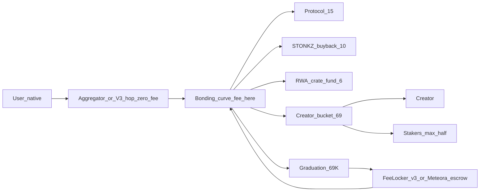

# External audit package

What to hand an auditor, and what to tell them. Refreshed 2026-10-01 for the
v2 fee split, Pyth/attested launches, the Uniswap v3 + Meteora graduation
paths, referral vaults and `$STONKZ`. Supersedes the Phase H version.

Nothing here has been externally reviewed. `docs/security-review-findings.md`
is an **internal** review by the same effort that wrote the code, which is
useful for triage and worthless as assurance. Do not describe the system as
audited until this package has been through a third party and the findings
closed.

---

## 0. The commit to audit

`c301cd1ec5208669a6e80a7802240aa97f3a4247` (`main`, 2026-10-01). **Pin at tag
`audit-1`** on that commit; the auditor checks out the tag, not a branch. Any
fix landed during the audit goes on a branch from the tag and is re-reviewed
as a diff against it.

Testnet deployments (§6) were made from earlier commits; the auditor should
treat the tagged source as authoritative and the testnets as a place to poke
live state, not as proof of what is deployed. The Solana record carries the
`sha256` of the local program build (`programSha256`), which has **not** yet
been confirmed against the on-chain ProgramData.

## 1. Scope

### 1.1 Robinhood Chain / Base (EVM), `programs/evm/src`

Solidity 0.8.28, `via_ir`, `optimizer_runs = 100`. Runtime sizes from
`forge build --sizes` at the tagged commit (EIP-170 limit 24,576 B).

| Contract                   | Path                              | Runtime (B) | Role                                                                                                                                                                                                          |
| -------------------------- | --------------------------------- | ----------- | ------------------------------------------------------------------------------------------------------------------------------------------------------------------------------------------------------------- |
| `StonkzLaunchpad`          | `StonkzLaunchpad.sol`             | **24,385**  | UUPS proxy. Curves, trades, fee ledgers (`protocolRevenue`, `stonkzOps`, `stonkzBurn`, creator bucket + staker accumulators), staking, graduation trigger, `accrueExternalFees`, pause flags, pauser, admin.  |
| `StonkzRouter`             | `StonkzRouter.sol`                | 13,140      | Immutable. Native-in/native-out atomic trades; Pyth-priced launches; attested stock launches; `graduateWithPriceUpdate`; aggregator and V3 hops.                                                              |
| `StonkzToken`              | `StonkzToken.sol`                 | 3,086       | Each launched memecoin: fixed supply, no mint, no owner, `burn` of own balance only.                                                                                                                          |
| `CurveMath`                | `CurveMath.sol`                   | 57 (lib)    | Fee split 15/10/6/69, staker peel, cashback decay, curve arithmetic, graduation threshold `GRAD_MCAP_USD_1E6 = 69_000e6`.                                                                                     |
| `UniswapV3Migrator`        | `UniswapV3Migrator.sol`           | 8,209       | Graduation into one full-range v3 position (1% tier) owned by `FeeLocker`; forwards collected fees to `accrueExternalFees`.                                                                                   |
| `FeeLocker`                | `FeeLocker.sol`                   | 5,135       | Immutable, ownerless holder of graduated positions. No `burn(amount > 0)` path; only `claimFees`.                                                                                                             |
| `ReferralVault`            | `ReferralVault.sol`               | 5,890       | Pays referral commissions against API-signed EIP-712 vouchers (cumulative amounts, per-day cap, pauser-stoppable).                                                                                            |
| `StonkzProtocolToken`      | `StonkzProtocolToken.sol`         | 8,959       | `$STONKZ`: OZ ERC20 + Burnable + Permit + `AccessControlDefaultAdminRules`; mint / admin-burn / freeze each sealable, then roles revoked.                                                                     |
| `PythPriceSource`          | `oracle/PythPriceSource.sol`      | 3,122       | `IPriceSource` over Pyth Core (`getPriceUnsafe`), confidence band, sanity band, fixed `$1.00` for USD stables, per-base fallback source.                                                                      |
| `StockPriceSourceV2`       | `oracle/StockPriceSourceV2.sol`   | 15,906      | Stock bases: Pyth equity leg, Uniswap V3 TWAP leg with liquidity floors, last-close anchor off hours, **signed per-launch attestation leg**, push fallback, band; never reverts.                              |
| `StockPriceSource`         | `oracle/StockPriceSource.sol`     | 11,794      | V1 of the above (no attestation leg). Retired on testnets; in tree as the base V2 extends.                                                                                                                    |
| `PushPriceSource`          | `oracle/PushPriceSource.sol`      | 3,381       | UUPS. Operator-pushed prices; now the fallback of last resort for RH stock bases.                                                                                                                             |
| `ChainlinkPriceSource`     | `oracle/ChainlinkPriceSource.sol` | 2,284       | Heartbeat-scale Chainlink reader. Not deployed; kept for chains with feeds.                                                                                                                                   |
| `SafeErc20`                | `SafeErc20.sol`                   | 57 (lib)    | Minimal in-tree safe-call wrappers (accepts empty or `true` return data). Not OpenZeppelin.                                                                                                                   |
| `UniswapV2Migrator`        | `UniswapV2Migrator.sol`           | 3,815       | **Legacy.** Burned LP to `0x…dEaD`. Replaced by the v3 migrator on 2026-09-30; still compiled, no longer installed.                                                                                           |
| `config/*`, `testnet/*`    | `config/`, `testnet/`             | —           | Chain constants (`RobinhoodChain`, `BaseSepolia`, `Arc`, `StockBases`), testnet-only helpers (`TestnetUsdg`, `StonkzV2Factory`, `V3ExactInputQuoter`, `LaunchpadRetargetPatch`). Out of scope except as data. |
| `script/GovernanceLib.sol` | `script/`                         | —           | Handover to `TimelockController` + pauser; `MainnetGuard` refuses direct proxy calls on mainnet. Review for correctness of the handover, not as runtime code.                                                 |

`StonkzLaunchpad` is **191 bytes** under the EIP-170 limit. Any finding whose
fix adds bytecode has to come with a byte-neutral suggestion or an
acknowledgement that something else must be cut.

### 1.2 Solana (Anchor 0.32.1), `programs/solana/programs/launchpad/src`

Program `FF1f3V47FtApwWWMHX462Gm7NVqNpUJ7K4yqKrYGSMbg` on devnet. IDL
committed at `programs/solana/idl/launchpad.json` (+ `launchpad.ts`), kept
equal to `anchor idl build` by `scripts/sync-idl.mjs --check`.

| Instruction(s)                                                                                                                                                                                                                                                  | File                                    | Notes                                                                                                                                                                                                                                                            |
| --------------------------------------------------------------------------------------------------------------------------------------------------------------------------------------------------------------------------------------------------------------- | --------------------------------------- | ---------------------------------------------------------------------------------------------------------------------------------------------------------------------------------------------------------------------------------------------------------------- |
| `create_token`                                                                                                                                                                                                                                                  | `instructions/create_token.rs`          | 17-account create; mint PDA seeded by creator + salt (duplicate tickers allowed); mint and freeze authority `None`; immutable Metaplex metadata with the curve PDA as update authority.                                                                          |
| `buy`, `sell`                                                                                                                                                                                                                                                   | `instructions/trade.rs`                 | 15 accounts (must fit behind a Jupiter route). Fee split asserted with `require!`; creator bucket credited **after** peeling the staker share.                                                                                                                   |
| `graduate`, `migrate_create_pool`, `migrate_seed_liquidity`, `claim_dex_fees`                                                                                                                                                                                   | `instructions/graduate.rs`              | Permissionless graduation. Hand-built CPI into Meteora DLMM (`lb_clmm`): `initialize_lb_pair2` at the curve close price with admin-chosen `PresetParameter2`, then a position owned by the per-mint escrow PDA. `claim_dex_fees` routes DLMM fees via the split. |
| `claim_creator_fees`                                                                                                                                                                                                                                            | `instructions/claim.rs`                 | Drains the creator ledger only; the staker share sits in the same vault under a different counter and is unreachable here.                                                                                                                                       |
| `stake`, `unstake`, `claim_stake`                                                                                                                                                                                                                               | `instructions/stake.rs`                 | Lock-weighted accumulators; settle-before-reweight.                                                                                                                                                                                                              |
| `initialize`, `set_pause`, `set_oracle_authority`, `set_max_oracle_staleness`, `set_meteora_config` (+ deprecated `set_raydium_config` alias), `set_withdraw_authorities`, `propose_admin` / `accept_admin`, `push_price`, `init_treasury`, `withdraw_treasury` | `instructions/admin.rs`                 | Admin is `Global.admin` (Squads vault on mainnet). Two-step admin and withdraw-authority rotation. `withdraw_treasury(Protocol                                                                                                                                   | Ops | Burn)`. |
| `set_pauser`, `pause`                                                                                                                                                                                                                                           | `instructions/pauser.rs`                | Pauser lives in its own PDA (`SEED_PAUSER`); it can only **set** flags; unpausing is admin's `set_pause`.                                                                                                                                                        |
| `init_referral_vault`, `fund_referral_vault`, `set_referral_signer`, `set_referral_paused`, `claim_referral`                                                                                                                                                    | `instructions/referral.rs`              | Ed25519 vouchers verified through the instructions sysvar; cumulative amounts; per-day cap; pauser can stop.                                                                                                                                                     |
| `sync_price_from_pyth`                                                                                                                                                                                                                                          | `instructions/sync_price.rs`, `pyth.rs` | Permissionless copy of a Pyth push-feed `PriceUpdateV2` into the base mint's `BaseOracle`; parsed by hand (no receiver SDK); older-than-stored is a no-op.                                                                                                       |
| `math.rs`, `parity.rs`, `state.rs`, `constants.rs`, `events.rs`, `errors.rs`, `metaplex.rs`                                                                                                                                                                     | —                                       | Arithmetic (parity-locked to `CurveMath.sol`), account layouts and seeds.                                                                                                                                                                                        |

### 1.3 Off-chain code that the contracts trust structurally, `apps/api/src`

In scope because it constructs calldata, signs messages the contracts verify,
or decides what the UI believes:

- `router/universal-router.ts` — hand-built Universal Router `execute()`
  command encoding (recipient must be the router, `MSG_SENDER`).
- `router/evm-router.ts`, `router/compose.ts` — composes `StonkzRouter`
  calls, slippage bounds, EIP-2612 permit handling.
- `router/evm-pyth.ts`, `router/evm-launch.ts` — fetches Hermes updates,
  builds `createAndBuyWithEth` / `createWithPriceUpdate` /
  `createAndBuyViaV3` / `graduateWithPriceUpdate`.
- `router/price-attest.ts` — **signs** stock price attestations
  (`STOCK_PRICE_ATTESTER_KEY`).
- `game/referral-signer.ts`, `router/evm-referral.ts`,
  `router/solana-referral.ts` — **signs** referral vouchers
  (`REFERRAL_SIGNER_KEY_EVM` / `_SOL`).
- `router/solana-idl.ts`, `router/solana-instructions.ts`,
  `router/solana-launch-tx.ts` — hand-derived discriminators, seeds and
  account orders for the Solana program.
- `routes/trade.ts` (`POST /trade/confirm`), `routes/trade-provisional.ts`
  — the provisional-fill fast path.
- `routes/admin*.ts`, `admin/*` — step-up auth and chain-ops encoders.

Out of scope for a contract audit (worth a separate application review):
`apps/web`, `apps/indexer`, the game ledger in `apps/api/src/game` (XP, SP,
crates), social and chat.

## 2. What the system does

A memecoin launchpad on Robinhood Chain, Base and Solana. A creator launches
a fixed-supply token against a base asset (WETH/USDG/USDC, RH stock tokens,
wSOL); it trades on a constant-product bonding curve with virtual reserves;
at a **$69,000** oracle-priced market cap it graduates and its liquidity
migrates to a real AMM position that no key can withdraw.

### 2.1 The fee split: 15 / 69 / 10 / 6, with a staker peel

Per-trade fee `feeBps` is creator-set within `[100, 500]` bps. Cashback
launches start at 5,000 bps and decay linearly to the base fee over 300 s
(`CurveMath.effFeeBps`). `CurveMath.splitFee` then splits the fee:

| Leg               | bps   | Ledger                              | Who can withdraw                                       |
| ----------------- | ----- | ----------------------------------- | ------------------------------------------------------ |
| Protocol          | 1,500 | `protocolRevenue[base]`             | protocol withdraw authority (`withdrawTreasury(0, …)`) |
| `$STONKZ` buyback | 1,000 | `stonkzOps[base]`                   | ops withdraw authority (`withdrawTreasury(1, …)`)      |
| RWA crate fund    | 600   | `stonkzBurn[base]` (historic name)  | ops withdraw authority (`withdrawTreasury(2, …)`)      |
| Creator bucket    | 6,900 | per-token, **defined as remainder** | split again below                                      |

`CurveMath.splitCreatorBucket(bucket, eligibleStaked, circulatingSupply)`
peels the staker share: `stakers = bucket × eligibleStaked / (2 ×
circulating)`, capped at half the bucket (34.5% of the fee), the creator
keeps the rest. Zero-weight FLEX positions are excluded from
`eligibleStaked`. Both legs accrue on the base side **and** the token side
(`_accrueBucketBase` / `_accrueBucketToken`), with dust carried forward.
Solana `trade.rs::credit_creator_bucket` does the same thing in the same
order, and `parity-vectors.json` pins both.

Referral commissions (15 / 10 / 5% of a referred trader's fee) come **out of
the protocol leg**, are accounted off chain, and are settled by moving funds
from the protocol vault into `ReferralVault` / the Solana `referral_vault`,
from which referrers self-serve against signed vouchers.

### 2.2 Graduation

**EVM.** `graduate` / `graduateWithPriceUpdate` closes the curve once the
oracle-priced cap is reached (or `oracleGraduationPaused` is lifted).
`UniswapV3Migrator` initialises a v3 pool at the curve's closing price (1%
tier), mints one full-range position owned by `FeeLocker`, and the launchpad
burns the unsold allocation. `FeeLocker` has no owner, no admin, no upgrade
path and no function that calls `burn` with a non-zero amount. Its only exit,
`claimFees`, collects swap fees and hands them to the _current_ migrator,
which calls `launchpad.accrueExternalFees` (migrator-gated) so post-bond
trading keeps paying the 15/10/6/69 split into the same ledgers.

**Solana.** `graduate` then `migrate_create_pool` + `migrate_seed_liquidity`
open a Meteora DLMM `LbPair` at the close price and deposit `SpotBalanced`
into a position owned by the per-mint escrow PDA (`SEED_METEORA_ESCROW`).
Nothing in the program withdraws, closes or reassigns that position.
`claim_dex_fees` claims the position's swap fees and routes them through the
split. `migration_authority` only fronts rent and is refunded.

### 2.3 Native in, native out

Users always pay in the chain's gas token. On EVM the trade is one
`StonkzRouter` call: `native → base` (WETH wrap, V3 `exactInputSingle`, or a
Universal Router leg with the **router** as recipient) `→ curve`, measured on
arrival, in one transaction. The aggregator hop must carry **zero** platform
fee; the curve fee is the only fee. On Solana a Jupiter route precedes `buy`
in the same transaction.

### 2.4 Launch pricing

EVM launches are priced by `PythPriceSource`: the router posts a signed
Hermes update (`pyth.updatePriceFeeds`, fee paid from `msg.value`, excess
refunded) and creates the coin in the same transaction, so the launchpad can
hold a tight bound. Stock bases fall back to `StockPriceSourceV2`, which
additionally accepts a **per-launch price the API signs** (`STKA` entries in
the same `priceUpdate` array) and cross-checks it against its other legs.
Solana launches bundle `sync_price_from_pyth` in front of `create_token`.



## 3. Trust model and authorities

| Role                             | Chain  | Can                                                                                                       | Cannot                                                          | Held by (testnet today → mainnet plan)                                                         |
| -------------------------------- | ------ | --------------------------------------------------------------------------------------------------------- | --------------------------------------------------------------- | ---------------------------------------------------------------------------------------------- |
| Admin                            | both   | Set pause flags (incl. unpause), price source, staleness, migrator, pauser, withdraw authorities; upgrade | Move any money                                                  | EOA → `TimelockController` behind a Safe (EVM, `docs/governance-handover.md`); Squads (Solana) |
| Pauser                           | both   | **Set** pause flags (`pause`), instantly                                                                  | Unpause, withdraw, upgrade, configure                           | unset → hot ops key / 1-of-N Safe                                                              |
| Protocol withdraw authority      | both   | `withdrawTreasury(0)` → protocol revenue, incl. funding referral vaults                                   | Pause, reach ops / crate fund                                   | EOA → Safe                                                                                     |
| Ops withdraw authority           | both   | `withdrawTreasury(1                                                                                       | 2)` → buyback and RWA crate fund                                | Pause, reach protocol revenue                                                                  | EOA → Safe |
| Migration authority              | both   | Trigger / front rent for migration                                                                        | Hold the position, take reserves                                | EOA                                                                                            |
| Oracle authority                 | Solana | `push_price`                                                                                              | Anything else                                                   | API-side key (RH stock bases still pushed)                                                     |
| Referral signer                  | both   | Sign cumulative referral vouchers                                                                         | Hold funds; exceed vault `maxPerDay`; survive a signer rotation | API process key (`REFERRAL_SIGNER_KEY_*`)                                                      |
| Stock price attester             | EVM    | Sign `(chainId, source, base, price1e6, publishTime)` quotes                                              | Bypass V2's cross-checks / freshness; move funds                | API process key (`STOCK_PRICE_ATTESTER_KEY`)                                                   |
| Pyth, Meteora, Uniswap, Metaplex | —      | Third-party programs the system CPIs/calls                                                                | —                                                               | External                                                                                       |
| Solana upgrade authority         | Solana | Replace the program                                                                                       | —                                                               | `EJ9qpuQosjwv8N1Rab7SK4zvVpEbvEBbCdum9KseADLn` (devnet) → Squads                               |

Both deploy scripts refuse a deployment where protocol and ops authorities
are the same key, or the admin equals either. On EVM mainnet `MainnetGuard`
refuses any script that would call the proxy directly: admin must already be
a timelock with ≥ 24 h delay.

### 3.1 API trust boundaries

- **The API holds no chain key that can move funds.** It builds unsigned
  transactions and the user's wallet signs. The admin panel is the same:
  every chain op is unsigned calldata / an unsigned Solana transaction signed
  in the operator's browser wallet or exported for a Safe.
- **Two message-signing keys** live in the API process: the stock price
  attester and the referral signers. Each only ever signs; the contracts
  bound what a leaked key could do (attestation cross-checks + `attestMaxAge
300 s`; vault `maxPerDay` + pauser stop + admin rotation).
- **Launch preflight** (`router/launch-preflight.ts`) simulates the exact
  transaction before the wallet sees it and maps on-chain refusals to client
  codes (`oracle_stale`, `oracle_unavailable`, `launch_paused`…). RPC failure
  lets the prepare through; only a node-reported execution failure blocks.
- **`POST /trade/confirm`** reads the transaction back at one confirmation,
  decodes `Trade` events with strict emitter checks, and publishes them as
  **provisional** fills in Redis/WS only. The indexer's authoritative fill
  (same `fid`) supersedes them; nothing provisional ever reaches the
  database.
- **Admin step-up:** normal SIWE/SIWS session, then a wallet-signed challenge
  (5-min nonce, single use) mints a 15-minute admin JWT with its own secret
  and audience; TOTP once enrolled; `ADMIN_IP_ALLOWLIST`; role re-read from
  DB on every request; non-admins get 404; append-only audit log; typed
  confirmation phrases on destructive actions. See `docs/admin-panel.md`.

## 4. Please focus on

Ranked by what would hurt most if wrong.

1. **Permanence of graduated liquidity.** EVM: can anything remove principal
   from a `FeeLocker` position (direct pool `burn` by the position owner,
   `collect` beyond fees, a malicious future migrator reached through
   `launchpad.migrator()`)? Solana: can any signer, including
   `migration_authority` or admin, withdraw, close or reassign the escrow
   PDA's DLMM position; can the pool be pre-created or front-run; can a
   second migration run; can `claim_dex_fees` reach principal?
2. **`StonkzRouter`.** Atomicity and refund correctness on every path
   (`buyWithEth`, `buyViaV3`, `buyViaAggregator`, `sellForEth`, `sellViaV3`,
   `sellViaAggregator`, `createAndBuyWithEth`, `createWithPriceUpdate`,
   `createAndBuyViaV3`, `graduateWithPriceUpdate`): fee smuggling past the
   `quotedOut` shortfall floor, mis-encoded recipients, value stranded in the
   router, the Pyth fee taken from `msg.value` and the excess refund, the
   `STKA` attestation entries being routed to the sink and never to Pyth, the
   EIP-2612 permit fall-through, `MAX_SLIPPAGE_BPS`.
3. **The 15/10/6/69 identity and the staker peel.** Asserted on every fill on
   both chains, creator bucket as remainder. Attack rounding, the half cap,
   `eligibleStaked` manipulation (FLEX positions, staking right before a
   fill), `accrueExternalFees` (only the migrator may call it; can a pool fee
   be double-counted or misattributed to a token?), and every claim path
   (`claimCreatorFees`, stake claims, `withdrawTreasury(0|1|2)`): can any
   leg reach another leg's ledger?
4. **Oracle handling.** `PythPriceSource`: confidence band, sanity band, per
   feed max age (120 s), fixed `$1.00` stables, fallback routing,
   `maxOracleStaleness` (90,000 s on testnets). `StockPriceSourceV2`: the
   attested leg's signature/freshness checks and how far an honest-but-wrong
   DefiLlama quote (or a leaked attester key) can move a launch price past
   the TWAP, last-close and Pyth cross-checks; liquidity floors on the TWAP
   leg; the "never reverts" contract when all legs fail. Solana
   `sync_price_from_pyth`: the hand-rolled `PriceUpdateV2` parse (owner,
   feed id, verification level, exponent, staleness), and `BaseOracle`
   authority for pushed bases. Both directions: a stale feed must not price
   a launch or a graduation, and a healthy one must not be rejected.
5. **Referral vaults.** Cumulative-amount vouchers (no nonce by design):
   replay, cross-chain/cross-vault replay (domain / `cluster_tag`), deadline,
   signer rotation, the per-day cap, the pauser stop, and the Ed25519
   instruction-sysvar verification on Solana (instruction index, program id,
   message bounds).
6. **Governance surface.** UUPS upgrade authorisation; storage layout
   discipline (the 2026-09-27 storage-shift incident is in
   `docs/fee-split-rollout.md`; `pauser` is slot 16 appended after `_lock`);
   the two-step admin and withdraw-authority rotations; the pauser being
   set-only; `MainnetGuard`; `StonkzProtocolToken` sealing and the
   default-admin renounce. Solana: `has_one` / `address =` constraints on
   every privileged instruction, PDA re-derivation on withdrawals and
   migration, `PauserConfig` as a separate PDA.
7. **Curve math.** `CurveMath.sol` ↔ `math.rs` parity via
   `programs/parity-vectors.json`; overflow headroom, rounding direction
   (always favour the curve), exhaustion boundary, the cashback decay clock
   (`block.timestamp` on an Orbit chain, see `docs/robinhood-chain.md` §5.1),
   `createToken` supply cap (1e12).
8. **`SafeErc20`.** First-party; review the return-data rule.

## 5. Known and accepted, before you file it

- **Crate RNG is HMAC commit–reveal, not a VRF** (`apps/api/src/game/
crates.ts`). Per-open server seed committed before the open, client seed
  mixed in, seed revealed with the result; a wallet can verify its own rolls
  with any HMAC tool. A VRF is still required before crate odds are
  marketed as "provably fair" (finding M2). Off-chain; listed so it is not
  reported as a discovery.
- **Admin is still an EOA on every testnet** and the Solana devnet admin is
  a plain keypair. The handover (`docs/governance-handover.md`) is a mainnet
  step; `MainnetGuard` enforces it there.
- **The testnet deployer key is burned.** It was shared in chat; nothing
  deployed with it is a mainnet artefact.
- **Non-atomic RH fallback exists by design** when `RH_ROUTER_ADDRESS` is
  unset or a base has no pinned V3 fee tier. Carries a user-visible warning;
  unacceptable for real funds; a deliberate degradation.
- **Legacy code in tree:** `UniswapV2Migrator` (replaced 2026-09-30),
  `StockPriceSource` V1, `LegacyPushPriceSource`, `set_raydium_config`
  (alias of `set_meteora_config`), `SEED_RAYDIUM_ESCROW`, and
  `tests/launchpad.ts`'s Raydium-era integration suite (skipped pending
  `lb_clmm` clones in `Anchor.toml`). Report anything live that still
  references them; do not audit them as live paths.
- **`StonkzLaunchpadV2` in the sizes table is a test fixture**
  (`test/Upgrade.t.sol`), not a contract.
- **Third-party trust:** Pyth (Hermes + on-chain), DefiLlama (attested stock
  quotes, cross-checked on chain), Meteora `lb_clmm`, Uniswap v3/Universal
  Router/Permit2, Metaplex Token Metadata. On 46630 the Universal Router's
  `WRAP_ETH` targets mainnet aeWETH, so WETH pairs use `buyWithEth` /
  `sellForEth`; there is no public V2 factory there, hence the Stonkz-owned
  `StonkzV2Factory` (legacy path).
- **Nothing is on mainnet.** There is no mainnet state to audit against.

## 6. Deployed testnet addresses

Source of truth: `programs/evm/deployments/<chainId>.json` and
`programs/solana/deployments/devnet.json` (full history, retired addresses
and smoke transactions live there; `scripts/emit-chains.mjs` folds them into
`apps/web/public/chains.json`).

### Robinhood Chain testnet (46630), redeployed 2026-09-27 at block 124,871,527

| Contract                   | Address                                                                                           |
| -------------------------- | ------------------------------------------------------------------------------------------------- |
| `StonkzLaunchpad` (proxy)  | `0xe308287C9A85E2B53F1027a1c589B5e3969928e8`                                                      |
| ↳ implementation           | `0xCc494654811164C14399b9b0be7773DC29Cc453a`                                                      |
| `StonkzRouter` (trusted)   | `0xA039af821d950C03EE870F05bF1A32F06F9053c5`                                                      |
| `PythPriceSource`          | `0x4DF51B8a92ce0c634Cd4bb7a799f8762A800cecA`                                                      |
| Pyth                       | `0x8250f4aF4B972684F7b336503E2D6dFeDeB1487a`                                                      |
| `StockPriceSourceV2`       | `0x5e36248dF811A4b8358014f71276714E196D00fE`                                                      |
| Stock price attester (EOA) | `0x7DB88BA71807567be8057aff24B2D2D6aeAF6650`                                                      |
| `PushPriceSource`          | `0x1440A9776a93dcb10c7B6AD9f8053Bac469637B8`                                                      |
| `UniswapV3Migrator`        | `0x7C6DE508a176E48Df24863845c603aDe3D656748`                                                      |
| `FeeLocker`                | `0xD30C019aF2039B0B1015cC9Be3f17f07ef457eD3`                                                      |
| `ReferralVault`            | `0x942A1eB9747Aa3b161cb3e7a068Fdf846B8bC445`                                                      |
| Referral signer (EOA)      | `0x104D6744d31940d7Aa2463962eA0B3CAD9cd9894`                                                      |
| Admin / ops withdraw       | `0x1FA9D4Ad76D53FbF1274d10ACBA12463ae90Bdca`                                                      |
| Protocol withdraw          | `0xFf888986b1e7Bf1ea2740825eeCB7fF98b484879`                                                      |
| WETH9 / USDG / TestnetUsdg | `0x7943…52Fa` / `0x7E95…802F` / `0x4bfB…E267`                                                     |
| Stock bases                | TSLA `0xC9f9…Bd4E`, AMZN `0x5884…9E02`, PLTR `0x1FBE…98d0`, NFLX `0x3b82…8C93`, AMD `0x7117…778d` |

### Base Sepolia (84532), redeployed 2026-09-27 at block 47,348,724

| Contract                  | Address                                                                                   |
| ------------------------- | ----------------------------------------------------------------------------------------- |
| `StonkzLaunchpad` (proxy) | `0x2f197741C3ca71e3FE885a4F74C0D44e3A774D35`                                              |
| ↳ implementation          | `0x911f58813FB4606bc03bb1e5875311f424d18Ba5`                                              |
| `StonkzRouter` (trusted)  | `0xe9085Fa0dc45F490048EAfBe8C86B6ABEaC07478`                                              |
| `PythPriceSource`         | `0x7DCcf6947891a0d55Dd82398Fc8B9Ff3b6C9000F`                                              |
| Pyth                      | `0xA2aa501b19aff244D90cc15a4Cf739D2725B5729`                                              |
| `PushPriceSource`         | `0x12DA47672287c188C79c1504eE72E2aC8b446f7B`                                              |
| `UniswapV3Migrator`       | `0x8A7A8CB703FE090eF8Fc2eb0622c8c1cCfB1A230`                                              |
| `FeeLocker`               | `0xC98F8214999220CE06E04ca8739A34Cb8AF5779c`                                              |
| `ReferralVault`           | `0xCfaAAeA8DE96f5ED6191Cd0A55Ecf2D6B1A09817`                                              |
| Referral signer (EOA)     | `0x104D6744d31940d7Aa2463962eA0B3CAD9cd9894`                                              |
| Admin / ops withdraw      | `0x1FA9D4Ad76D53FbF1274d10ACBA12463ae90Bdca`                                              |
| Protocol withdraw         | `0xFf888986b1e7Bf1ea2740825eeCB7fF98b484879`                                              |
| Uniswap                   | UR `0x492E…4104`, SwapRouter02 `0x94cC…2bc4`, V3 factory `0x4752…aD24`, Permit2 canonical |

No stock bases on Base.

### Solana devnet

| Item                    | Value                                                              |
| ----------------------- | ------------------------------------------------------------------ |
| Program                 | `FF1f3V47FtApwWWMHX462Gm7NVqNpUJ7K4yqKrYGSMbg`                     |
| Upgrade authority       | `EJ9qpuQosjwv8N1Rab7SK4zvVpEbvEBbCdum9KseADLn`                     |
| Last upgrade            | slot 505,697,751 (2026-09-30); ProgramData 859,656 B               |
| `programSha256` (local) | `9d58f238b4e9b1e220888d56834cbf0b67a169958b636d9e84217ba90da80a7d` |
| Referral vault (wSOL)   | `4gtgiR1buzGWBvWf1w3zBYGEFCMvoi9Us4rf7dfeyGz1`                     |
| Referral config         | `BiDP3XCAAZpcP4zzNjcLU5B2LkLjmSReikiqYiFnWJSN`                     |
| Referral signer         | `rwp1sFwu9gvCHWdeiyVGoXivJXuqDtFTgGn6yhsr3rP` (1 SOL/day)          |
| Meteora `lb_clmm`       | `LBUZKhRxPF3XUpBCjp4YzTKgLccjZhTSDM9YuVaPwxo`                      |

## 7. How to build and test

```bash
# EVM — 31 suites, 319 passing, 8 skipped (the fork tests, below) at the tag
cd programs/evm && forge build --sizes && forge test

# Fork tests: each is skipped unless its env is set. All take an RPC URL and
# the live proxy / addresses to fork against.
RH_RPC_URL=<rpc> forge test --match-test Fork                          # Router.t.sol: UR + Permit2 hold code
FEE_FORK_RPC=<rpc> FEE_FORK_PROXY=<launchpad> FEE_FORK_TOKEN=<coin> \
  forge test --match-path test/fork/FeeJourneyFork.t.sol
GRADUATION_FORK_RPC=<rpc> GRADUATION_FORK_LAUNCHPAD=<proxy> GRADUATION_FORK_WETH=<weth> \
  forge test --match-path test/fork/GraduationFork.t.sol
V3_FORK_RPC=<rpc> V3_FORK_LAUNCHPAD=<proxy> V3_FORK_WETH=<weth> V3_FORK_FACTORY=<v3factory> \
  forge test --match-path test/fork/V3GraduationFork.t.sol
STOCK_FORK_RPC=<rpc> STOCK_FORK_PROXY=<proxy> forge test --match-path test/fork/StockLaunchFork.t.sol
ROLLOUT_FORK_RPC=<rpc> ROLLOUT_FORK_PROXY=<proxy> [ROLLOUT_FORK_PYTH_UPDATE=<hex>] \
  forge test --match-path test/fork/RolloutFork.t.sol
RECOVER_FORK_RPC=<rpc> RECOVER_FORK_PROXY=<proxy> forge test --match-path test/fork/RecoverLayout.t.sol

# Storage layout (do this before judging any upgrade; see docs/fee-split-rollout.md)
forge inspect StonkzLaunchpad storage-layout

# Solana
cd programs/solana && pnpm install && anchor build       # anchor-cli 0.32.1
cargo test -p launchpad --lib                            # 45 host-side tests: arithmetic, parity, layouts
node ../../scripts/sync-idl.mjs --check                  # committed IDL == anchor idl build
node ../../scripts/sync-idl.mjs --hash                   # sha256 of target/deploy/launchpad.so
anchor test                                              # legacy local-validator suite (Raydium clones; mostly skipped)

# Meteora graduation and referral suites run against a hand-started validator;
# the exact `solana-test-validator --clone-upgradeable-program …` lines are in
# the headers of tests/meteora-graduation.ts and tests/referral.ts.

# Cross-chain parity (EVM Parity.t.sol + Rust parity.rs + TS curve-sim)
pnpm verify:parity

# API (vitest): router encoders, attestation and voucher signing, confirm path,
# admin step-up, chain-ops selector/discriminator pins
pnpm test
```

`Anchor.toml` still clones the Raydium CPMM program for the legacy suite.
The Meteora path is covered by the unit tests in `graduate.rs` and the
by-hand `meteora-graduation.ts` run against the real `lb_clmm` program.

## 8. Deliverables we want back

1. Findings with severity, exploitability and a concrete PoC where possible,
   each tagged with the byte cost of the proposed fix on `StonkzLaunchpad`.
2. An explicit yes/no on graduated principal being unreachable on **all
   three** deployments (v3 `FeeLocker` on RH and Base, Meteora escrow on
   Solana).
3. An explicit yes/no on the aggregator / V3 hop carrying zero platform fee
   and on the router never holding value after a call returns.
4. Confirmation that no authority can reach funds outside its role, and that
   the pauser can only ever halt.
5. An assessment of how far a leaked attester key or referral signer key can
   go given the on-chain bounds.
6. Anything in `accrueExternalFees` / `claim_dex_fees` that would let
   post-bond fees be misattributed between tokens or legs.
