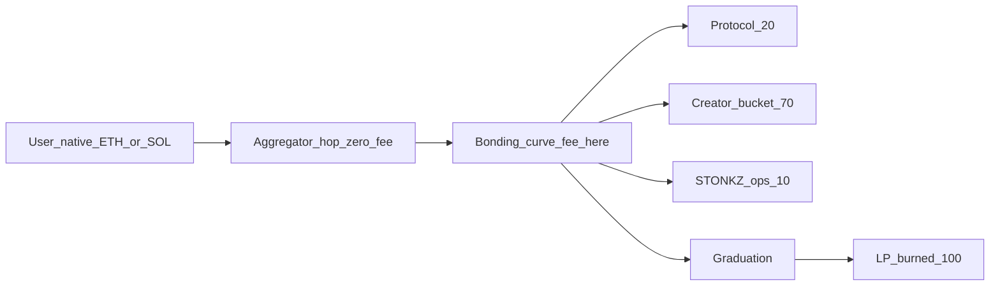

# External audit package

What to hand an auditor, and what to tell them. Phase H of the post-build
forward plan.

Nothing here has been externally reviewed. `docs/security-review-findings.md`
is an **internal** review by the same effort that wrote the code, which is
useful for triage and worthless as assurance. Do not describe the system as
audited until this package has been through a third party and the findings
closed.

---

## 1. Scope

| Chain | Path | Contracts / modules | Source LOC |
|---|---|---|---|
| Robinhood Chain (EVM, 4663) | `programs/evm/src` | `StonkzLaunchpad`, `StonkzRouter`, `StonkzToken`, `UniswapV2Migrator`, `CurveMath`, `SafeErc20`, `ChainlinkPriceSource`, `PushPriceSource`, `RobinhoodChain` config | ~2,110 |
| Solana (Anchor) | `programs/solana/programs/launchpad/src` | `create_token`, `trade`, `graduate`, `stake`, `claim`, `admin`, `math`, `state` | ~4,200 (incl. in-tree tests) |

Also in scope, because it constructs calldata the contracts trust structurally:

- `apps/api/src/router/universal-router.ts` — hand-built Uniswap Universal
  Router `execute()` command encoding.
- `apps/api/src/router/evm-router.ts` — composes `StonkzRouter` calls, slippage
  bounds, EIP-2612 permit handling.

Out of scope for a contract audit (worth a separate review): `apps/web`,
`apps/indexer`, the game ledger in `apps/api/src/game`.

Pin the audit to a commit. As of writing: `0ea89e5`.

## 2. What the system does

A memecoin launchpad on two chains. A creator launches a fixed-supply token
against a base asset; it trades on a constant-product bonding curve with
virtual reserves; at a $69,000 market cap it graduates, its liquidity migrates
to a real AMM pool, and **100% of the LP is burned**.

Per-trade fee, set by the creator within bounds, splits **20 / 70 / 10**:

- 20% protocol revenue
- 70% a per-token creator bucket, from which memecoin stakers can draw at most
  half (so the creator always keeps at least 35% of the fee)
- 10% a `$STONKZ` ops vault, which accrues natively and **has no spend path
  implemented** (that is Phase 7; the token does not exist)

Users always pay in the chain's native gas token. A trade is
`native -> base (aggregator) -> curve`, and the aggregator hop must carry
**zero** platform fee.



## 3. Trust model and authorities

Five separate roles, deliberately not collapsible. See `docs/deployment.md` §0.

| Role | Can | Cannot |
|---|---|---|
| Admin | Pause, set oracle/migrator config | Move any money |
| Protocol withdraw authority | Withdraw the 20% | Pause, or reach the ops vault |
| Ops withdraw authority | Withdraw the 10% | Pause, or reach protocol revenue |
| Migration authority | Trigger graduation migration | Hold the LP, or take the reserves |
| Oracle authority (Solana) | Push base prices | Anything else |

Both deploy scripts refuse a deployment where protocol and ops authorities are
the same key, or the admin equals either.

**The API process holds none of these keys.** It builds unsigned transactions.

## 4. Please focus on

Ranked by what would hurt most if wrong.

1. **The LP burn is the product's central claim.** On Solana,
   `migrate_liquidity` CPIs into Raydium CPMM using *this program's own PDA* as
   a non-canonical `pool_state` (so nobody can pre-seed it), routes the deposit
   through an escrow PDA that acts as Raydium's `creator`, and burns 100% of
   the minted LP before control returns to any signer. Please attack: can any
   key recover that LP, can the pool be occupied or front-run first, can the
   escrow be left holding value, can a second migration run?
2. **`StonkzRouter` atomicity and the Universal Router encoding.** The router
   makes itself the swap recipient (`MSG_SENDER = address(1)`, **not**
   `ADDRESS_THIS`), measures what actually arrived, and spends it on the curve
   in the same transaction. The commands are built by our API, not forwarded
   from Uniswap's `/v1/swap`. Please attack: fee smuggling past the
   `quotedOut` shortfall check, mis-encoded recipients, value stranded in the
   router, the EIP-2612 permit path (replay, malformed permit), and the
   `MAX_SLIPPAGE_BPS` clamp.
3. **The 20/70/10 identity.** Asserted with `require`/`require!` on every fill
   on both chains, with the creator bucket defined as the remainder so rounding
   cannot break the identity. Please attack the rounding and the claim paths:
   can a staker draw more than half the creator bucket, can either treasury be
   reached from a user-facing claim?
4. **Oracle handling, per chain.** Robinhood Chain's Chainlink feeds have an
   **86400-second heartbeat**; the EVM staleness bound is heartbeat-scale by
   design and a short bound there is a liveness bug (already hit once).
   Solana's `BaseOracle` is program-owned and pushed on a fast cadence, so its
   bound is short. Please confirm both directions: a stale feed must not price
   a graduation, and a healthy feed must not be rejected.
5. **Solana account validation.** Every privileged instruction constrains its
   signer with `has_one` / `address = global.<field>`; vault PDAs are
   re-derived from seeds rather than trusted from the caller. Please attack
   account substitution, especially on withdrawals and migration.
6. **Curve math edge cases.** `CurveMath.sol` and `math.rs` are held to
   atom-for-atom parity by `programs/parity-vectors.json` (EVM `Parity.t.sol`,
   Rust `parity.rs`). Please attack overflow headroom, rounding direction
   (must always favour the protocol/curve, never the trader), and the
   exhaustion boundary.

## 5. Known and accepted, before you file it

- **Crate RNG is HMAC, not a VRF** (`apps/api/src/game/crates.ts`). Auditable
  by the operator, not publicly verifiable. Known; odds are not marketed.
  Off-chain, listed only so it isn't reported as a discovery.
- **`$STONKZ` Phase 7 does not exist.** No buy-burn, no POL, no locker. The
  ops vault only accrues. Please don't audit what isn't there; please *do*
  flag anything in the accrual that would make a future sweep unsafe.
- **`SafeErc20` is a minimal in-tree library**, not OpenZeppelin (no OZ in
  `lib/`). Review it as first-party code.
- **Non-atomic RH fallback exists by design** when `RH_ROUTER_ADDRESS` is
  unset or a base asset has no pinned v3 fee tier. It carries a user-visible
  warning. We consider it unacceptable for real funds and intend the atomic
  path to be configured; the fallback's continued existence is a deliberate
  degradation, not an oversight.
- **Nothing has ever been deployed.** There is no mainnet state to audit
  against, and no fork test beyond one that checks the pinned Universal Router
  and Permit2 hold code.

## 6. How to build and test

```bash
# EVM
cd programs/evm && forge build && forge test            # 81 passing, 1 skipped
RH_RPC_URL=<rpc> forge test --match-test Fork           # the skipped one

# Solana
cd programs/solana && anchor build
cargo test -p launchpad --lib                           # host-side arithmetic
anchor test                                             # integration, clones real Raydium CPMM (devnet)

# Cross-chain parity
pnpm --filter @stonkz/launchpad-solana verify:parity
```

`Anchor.toml` clones the real Raydium CPMM program and its default `AmmConfig`
from devnet into the local validator, so the migration tests exercise Raydium's
own account validation rather than a mock.

## 7. Deliverables we want back

1. Findings with severity, exploitability, and a concrete PoC where possible.
2. An explicit yes/no on the LP burn being irreversible on **both** chains.
3. An explicit yes/no on the aggregator hop carrying zero platform fee.
4. Confirmation that no authority can reach funds outside its role.
5. Anything in the accrual paths that would make the Phase 7 sweep unsafe to
   add later.
