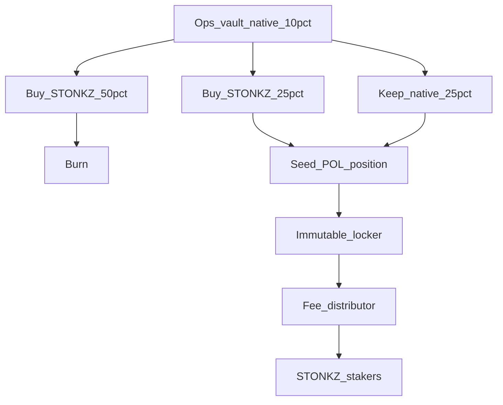

# Phase 7 — `$STONKZ` ops-vault sweep, POL, and staker fee claims

**Status: designed, deliberately not implemented.** The `$STONKZ` token does
not exist, so there is nothing to buy, burn, or pair. Writing and shipping the
executor now would mean untested contracts against a nonexistent token and
unpinned pools, which is the one failure mode this build has consistently
avoided.

What is implemented today: the **10% accrual only**. Both chains route 10% of
every curve fee into an ops vault that is withdrawable solely by the ops
withdraw authority (`stonkzOps[baseToken]` on EVM; the `SEED_OPS_VAULT` PDA on
Solana). `programs/SPEC.md` states plainly that no `$STONKZ` buy/LP/burn logic
exists anywhere in the programs, and `apps/api/src/routes/rewards.test.ts`
pins that no spendable `$STONKZ` balance leaks to a client before this phase.

This document exists so that when the gate opens, the work is mechanical
rather than a fresh design exercise.

## Gate

Do not start implementation until all of these hold:

1. A `$STONKZ` token exists on at least one chain, with a pinned address.
2. Phases B-F are green: real wallets, real indexer ingestion, deployed
   programs, and a dual-chain E2E pass on funded testnets.
3. A liquid `$STONKZ` pool exists with enough depth that a sweep-sized buy is
   not itself the price action.

## The recipe

Of the accrued ops vault balance, per sweep:

| Share | Action                                                        |
| ----- | ------------------------------------------------------------- |
| 50%   | Buy `$STONKZ` on the open market and **burn** it              |
| 25%   | Buy `$STONKZ` to seed one side of protocol-owned liquidity    |
| 25%   | Keep as native (SOL / ETH) to seed the other side of that POL |

The arithmetic already exists and is unit-tested: `opsSplit` in
[`packages/shared/src/fees.ts`](../packages/shared/src/fees.ts). The executor
must consume that function rather than re-deriving the percentages, so a change
to the recipe is a one-place change.



## Architecture decision: no launchpad change is required

The ops funds already leave the launchpad through a normal authority
withdrawal. The sweep therefore operates **downstream**, on withdrawn funds,
and needs no modification to `StonkzLaunchpad` or the Anchor program.

This is the right seam and should be preserved. It means Phase 7 cannot
introduce a bug into the trading path, and the audited fee-split logic does not
have to be re-audited to ship it.

## The locking mechanism, per chain

The plan's original wording was "lock and burn the LP, but keep fee-claim
authority". Taken literally that is impossible for a Uniswap v2 pool: v2 LP is
fungible, and burning it destroys the fee claim along with the principal. That
is exactly why memecoin graduation burns v2 LP (the claim is _meant_ to die
there — see `UniswapV2Migrator.sol`) and why POL must use a different
mechanism.

Both chains have a purpose-built one.

### Robinhood Chain: Uniswap v3 position + immutable locker

A v3 position is an ERC-721 held by the `NonfungiblePositionManager` (NFPM,
`0x73991a25C818Bf1f1128dEAaB1492D45638DE0D3` on 4663). `NFPM.collect()` moves
**only** accrued fees and never touches principal, so a contract that holds the
NFT and exposes nothing but `collect()` gives exactly the property wanted:
liquidity permanently immobile, fees permanently claimable.

Implement `LpFeeLocker.sol`:

```solidity
constructor(INonfungiblePositionManager nfpm, uint256 tokenId, address feeRecipient)
function collectFees() external returns (uint256 amount0, uint256 amount1)
```

Requirements, all load-bearing:

- `nfpm`, `tokenId`, and `feeRecipient` are **immutable**. A settable recipient
  on a contract holding permanent liquidity is a compromised-key drain.
- **No** `decreaseLiquidity`, no `withdraw`, no NFT transfer path, no owner, no
  pause, no upgrade, no `selfdestruct`. Implement `onERC721Received` so the
  position can arrive, and nothing that can send it back.
- `collectFees()` is permissionless to call, with `recipient` fixed to
  `feeRecipient` in the `CollectParams`. Anyone may trigger a claim; nobody can
  redirect it.
- `feeRecipient` must be the staker distributor contract, **never an EOA** (see
  the risk note below).

Uniswap v4 is also live on 4663 and would work via `modifyLiquidities()` with a
zero-amount `decreaseLiquidity` to realize fees. **Choose v3.** The v3
`collect()` path is simpler, has a much longer track record, and the extra
encoding surface of v4 buys nothing for a single permanent full-range position.

### Solana: Raydium Burn & Earn

Raydium ships this natively. Locking a CPMM LP position (or a full-range CLMM
position) moves it into a program-owned escrow with **no withdraw path**, and
mints a transferable **Fee Key NFT** that carries the right to call
`collectFees` on the locked position.

Use it rather than writing a custom locker. It is battle-tested, and Raydium's
own LaunchLab uses the same mechanism for graduated-token LP.

Verify the Burn & Earn / LP-lock program address against Raydium's live
reference at build time. The published addresses have shifted between the
`Burn & Earn` product page and the SDK's `LOCK_CPMM_PROGRAM` constant, and this
document deliberately does not pin one — resolve it then, the way
`init-deployment.ts` resolves the CPMM `AmmConfig`, and cross-check the
derivation before writing it into config.

## The risk this design turns on

**The fee-claim right is itself a transferable asset.** Raydium's Fee Key NFT
is explicitly transferable — "whoever owns it owns the fee stream" — and a v3
position NFT is the same. If either lands in a wallet, that wallet can sell the
protocol's perpetual fee stream, and no amount of "the LP is locked" messaging
changes that.

So:

- On Solana, the Fee Key NFT must be held by a **program-owned PDA** whose only
  instruction routes collected fees to the `$STONKZ` staker distribution, with
  no transfer instruction for the NFT itself.
- On RH, the position NFT must be held by `LpFeeLocker` as above, and the
  locker's immutable `feeRecipient` must be the distributor contract.

Holding either in a multisig is **not** sufficient. The claim is that these
fees go to stakers for life; a key that can move the NFT is a key that can
revoke that.

## Staker fee claims

`$STONKZ` staking is a **separate product** from memecoin staking and must not
share its accounting:

|               | Memecoin staking (shipped)                      | `$STONKZ` staking (Phase 7)               |
| ------------- | ----------------------------------------------- | ----------------------------------------- |
| Stake asset   | An individual launched token                    | `$STONKZ`                                 |
| Reward source | That token's 70% creator bucket, capped at half | POL trading fees from the locked position |
| Scope         | Per token                                       | Protocol-wide                             |

Reuse the shipped staking program's accumulator pattern
(`accBasePerWeight` / reward-per-weight with debt checkpoints) rather than
inventing a distribution model. Two specific traps that were already found and
fixed once in the memecoin staking implementation, and will recur here:

1. **Accumulator scale.** Both chains truncated rewards to zero for large
   stakes before the scaling factor was fixed. Add the same full-supply-range
   regression test before shipping.
2. **Rewards arrive as two assets.** POL fees come in as both `$STONKZ` and
   native, so the distributor needs two accumulators, not one.

## Implementation order, when the gate opens

1. Deploy `$STONKZ` and establish a liquid pool.
2. Build and audit the distributor first — it is the contract that holds the
   perpetual claim, and it is the one whose compromise is unrecoverable.
3. Build the locker, and lock the POL position into it.
4. Build the sweeper last. Until it exists, the ops vault continues to accrue
   safely and a sweep can be executed manually by the ops authority following
   the same 50/25/25 recipe.
5. Wire the staker claim UI.
6. Update [`real-vs-simulated.md`](real-vs-simulated.md) §7 and the
   do-not-claim table in [`launch-checklist.md`](launch-checklist.md).

Until step 6, say nothing publicly about buybacks, burns, or protocol-owned
liquidity. The accrual existing is not the mechanism existing.
